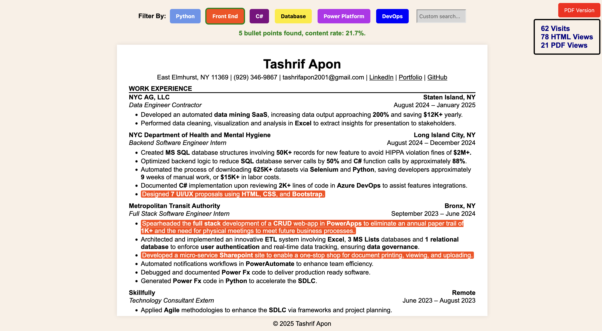
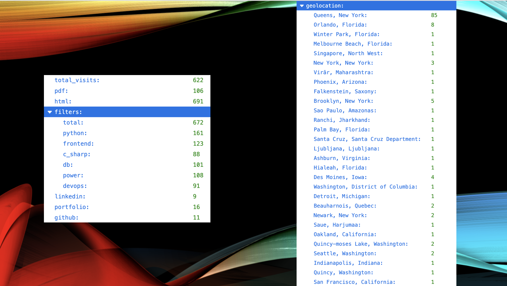

<h1><a href="https://tashrifapon.pythonanywhere.com/TashrifAponResume">Interactive Resume (Click Me!)</a></h1>
<a href="https://tashrifapon.pythonanywhere.com/TashrifAponResume"></img></a>

<h3 align="center">Metrics (Backend)</h3>
</img>

## 📚 Table of Contents
- ? <a href="#-why-i-built-it">Why I Built It</a>
  - ✅ [Why You Should Too](#unintended-goodies)
- ✨ <a href="#-features">Features</a>
- 📣 <a href="#-testimonials">Testimonials From Professionals</a>
- 📦 <a href="#-adapt-it-for-you">Adapt It For You!</a>
- ⚙️ <a href="#%EF%B8%8F-setup-instructions">Setup Instructions</a>
  - [Directory Structure](#directory-structure)
- 📈 <a href="#-next-steps">Next Steps</a>
- ☎️ <a href="#%EF%B8%8F-contact-for-help-or-collaboration">Contact (For Help or Collaboration)</a>
- 🤝 [Helpful Notes](#-helpful-notes)

---

## ? Why I Built It
### Background
I started of focusing primarily in the backend, so my earlier work (like my website) started off as such. Not long after, I started doing more (nice and private) full-stack work. My assumption was that whoever arrives at my website/resume would be impressed by the work I had already done. I realized it is not a good look from most that an aspiring SWE has such a blank website; they don't see my success in performance, backend, and private full-stack work.
### First Steps
I thought I would just make it a bit more acceptable: a background color and some formatting (centering a div, LOL). Me being me (curious, passionate, and data-centric), I started doing more (elaborated further on).
### Unintended Goodies
<details>
<summary><b>Click to Expand</b></summary>
<ul>
  <li>
    <h4>Birdseye View:</h4>
    <ul>
      <li>
        This can put into perspective how ATS or others may perceive you; I never realized how much of my experience was DB rich until I saw the "Content Rate". 
      </li>
    </ul>
  </li>
  
  <li>
    <h4>Having Something Complete (Technically and Literally) & Unique To Show For:</h4>
    <ul>
      <li>
        Although I have done impressive work, they are not authorized for the public eye. Now, I can show and speak about something full stack. In fact, I got to do it in a final round interview, not only full-stack but architecture too! Instead of the usual interview template,<b> your interview can and should be memorable!</b>
      </li>
      <li>
        Having something unique is important. Firstly, it is interesting by nature of it being unique. Secondly, <b>it demonstrates that you are beyond just someone that codes. You can show promise long-term.</b> Literally yesterday as I write this, another interviewer said this was the best interactive resume she has seen.
      </li>
      <li>
        Going back to my first point (and my second point), <b>having something to talk about is amazing in interviews</b>. You can avoid redundant pauses and being bombarded with just technical stuff. This bombardment is not a one way street; the interviewers may very likely remember that vibe. Give them a different vibe and stand out from others!
      </li>
    </ul>
  </li>
  
  <li>
    <h4>See Where My Visitors Are From:</h4>
    <ul>
      <li>
        If I see my audience is from Nebraska or the DMV area, then I can assume that my embedded skills are receiving attention. Then, I can focus my resume (and coding) efforts on that (i.e. C/C++). <b>You want to come across as specialized not a jack of all trades, master of none!</b>
      </li>
    </ul>
  </li>

  <li>
    <h4>See Which Buttons Clicked:</h4>
    <ul>
      <li>
        I can see which of my skill are wanted and in which rank!
      </li>
    </ul>
  </li>

  <li>
    <h4>See Which Links Are Being Clicked:</h4>
    <ul>
      <li>
        Say I am short on time and want to revamp my profile to better my candidacy. If I see my LinkedIn is my most popular link, I want to direct my efforts to optimize that profile.
      </li>
    </ul>
  </li>

  <li>
    <h4>Fun:</h4>
    <ul>
      <li>
        Sometimes, we forget why we got into this beautiful field. This brought back the pleasant memories. It is motivating to continue on this path and support the realization that I am more than just a coder.
      </li>
    </ul>
  </li>
</ul>
</details>

---

## ✨ Features
### 🎇 UI/UX

<details>
<summary><b>Click to Expand</b></summary>

- Buttons:
  - Color-Coded Highlighting
  - Active Border & Hover
  - Top-Right One Is Dynamic
- Custom Search
- Query Result:
  - Green if found and shows content rate
  - Red if none
- Links:
  - Active Hover
- Quick Metrics (Top-Right):
  - Total Visits
  - Which Formats Have Been Chosen

</details>

### 💻 Backend & Metrics 📊
<details>
<summary><b>Click to Expand</b></summary>

#### User Interaction Metrics:
- Buttons
- Links
- Visits
#### 🌎 Other Metrics:
- Visitor Geolocation
#### 🔐 Privacy:
- Abstracted Passkey
#### ⛓️ APIs:
- Internal: Read & Write Metrics
- External: Geolocation
- ❌ No Dirty Reads/Writes (FileLock)
</details>

### Feature-Service Matrix
<table>
  <tr>
    <th></th>
    <th>Frontend</th>
    <th>Backend</th>
    <th>Metrics (resume.json)</th>
    <th>Frontend APIs</th>
    <th>Backend APIs</th>
    <th>External APIs</th>
  </tr>

  <tr>
    <th>Buttons Clicked</th>
    <td>☑</td>
    <td>☑</td>
    <td>☑</td>
    <td>☑</td>
    <td>☑</td>
    <td></td>
  </tr>

  <tr>
    <th>Custom Search</th>
    <td>☑</td>
    <td></td>
    <td></td>
    <td>☑</td>
    <td></td>
    <td></td>
  </tr>

  <tr>
    <th>Content Rate</th>
    <td>☑</td>
    <td></td>
    <td></td>
    <td>☑</td>
    <td></td>
    <td></td>
  </tr>

  <tr>
    <th>Highlighting</th>
    <td>☑</td>
    <td></td>
    <td></td>
    <td>☑</td>
    <td></td>
    <td></td>
  </tr>
  
  <tr>
    <th>Link Interaction</th>
    <td>☑</td>
    <td>☑</td>
    <td>☑</td>
    <td>☑</td>
    <td>☑</td>
    <td></td>
  </tr>

  <tr>
    <th>Visitor Geolocation</th>
    <td></td>
    <td>☑</td>
    <td>☑</td>
    <td>☑</td>
    <td>☑</td>
    <td>☑</td>
  </tr>
</table>

---

## 📣 Testimonials
<b>Key Takeaway: It's Unique and Captivates Attention!</b> You want eyes, especially in this market (2025).

<table>
  <tr>
    <th></th>
    <th>Said</th>
    <th>Person's Role</th>
    <th>Company (Industry)</th>
  </tr>

  <tr>
    <th>Interviewer</th>
    <td><b>It's the best interactive resume she has seen.</b> I was a bit surprised that she has seen others.</td>
    <td>HR/Staffing</td>
    <td>UKG (Tech)</td>
  </tr>

  <tr>
    <th>Tech Career Expo Speaker</th>
    <td><b>She really liked it and asked me to follow up with her!</b> It came up naturally as I realized that what I had been working on was a solution to the problems another program attendee was sharing, so I offered to showcase it. Many attendees liked it and connected with me following the showcase!</td>
    <td>Manager CyberSec Consultant</td>
    <td>E&Y (Accounting/Consulting)</td>
  </tr>

  <tr>
    <th>Seasoned SWE</th>
    <td>It's really unique; she had <b>never seen something like it.</b> She went on to compliment me about being talented.</td>
    <td>QA Manager</td>
    <td>Clair (FinTech)</td>
  </tr>

  <tr>
    <th>LinkedIn Connection</th>
    <td>
      "Overall, I think this is excellent and great. I love how clicking each filter highlights the corresponding section of your resume. It really enhances navigation. The green highlights with '2 bullet points found, content rate: 8.7%' are amazing, your work is truly impressive! 🎉 Keep up the great work! If you need help with anything specific, let me know. I’d be happy to help." <b>This is great: collaboration! I love organic networking.</b>
    </td>
    <td>SWE</td>
    <td>Deloitte (Accounting/Consulting)</td>
  </tr>

  <tr>
    <th>Ex-Coworker</th>
    <td>
      "I can't wait to see the final product. Keep up the good work!"
    </td>
    <td>Product Manager Intern</td>
    <td>NYC DOHMH (Healthcare)</td>
  </tr>
</table>

---

## 📦 Adapt It For You!
##### Change The Following

### Firstly, The Resume
<details>
<summary><b>Click to Expand</b></summary>

#### Static (PDF Version)
- If you use a different name for your resume file, then "TASE" in "TASE.pdf" will need to be replaced.

#### HTML Version
- Change the content

</details>

### More Files
##### These have comments (up to top and throughout) regarding the changes needed
- resume.css
- resume.js

### .env
- Choose a decent passkey

---

## ⚙️ Setup Instructions
### Clone The Repo
```bash
git clone https://github.com/tashrifapon/Interactive-Resume
cd Interactive-Resume
```
### Make Sure You Have The Correct Packages
```bash
pip install -r requirements.txt
```
### B.T. DUBS
- this is in Python Version >= 3.9.6
- I used a virtual environment and would recommend doing so (locally and on your hosting platform)

### Directory Structure
```
Interactive-Resume/
├── app.py
├── .env                           # Passkey to see resume.json
├── templates/
    ├── resume.html
├── static/
    ├── resume.css
    ├── resume.js
    ├── resume.json                # Metrics file
    ├── TASE.pdf                   # Resume (PDF)
├── requirements.txt
```
---

## 📈 Next Steps
I can see this being much more than it is. If you want to collaborate in any way, please contact!

## ☎️ Contact (For Help or Collaboration)
I am best reachable via <b>email</b> or a <b>LinkedIn DM</b>, feel free to <a href="https://www.linkedin.com/in/tashrifapon/">connect</a>!

---

## 🤝 Helpful Notes
### Hosting
I personally use Anaconda's <a href="https://www.pythonanywhere.com">PythonAnywhere.com</a>, and it's free! 

If you do this and get stuck in DevOps/Platform Engineering tasks, I should be able to help, or you could ask ChatGPT or look at the platform's documentation regarding modules, specifically dotenv; it gave me a problem too.

Also, <b>enable "Force HTTPS"</b> and <b>specify your static file path</b> under "Web."
### FAQ's
1) How do I access resume.json: <b>https://your.URL/static/resume.json?passkey=yourPasskeyGoesHere</b>
    - That is the deafualt value, but you should change it in your .env file.
